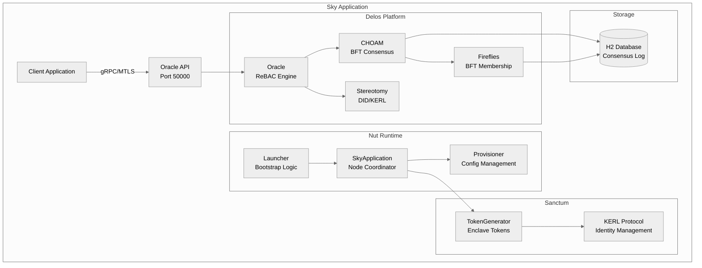
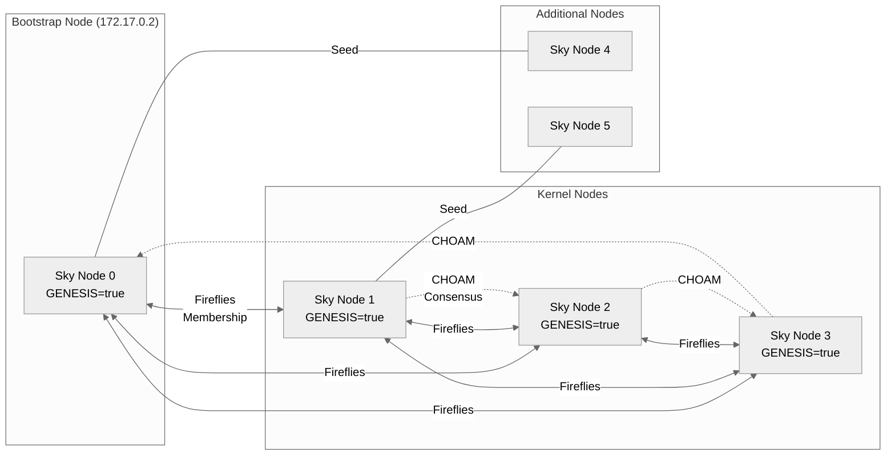
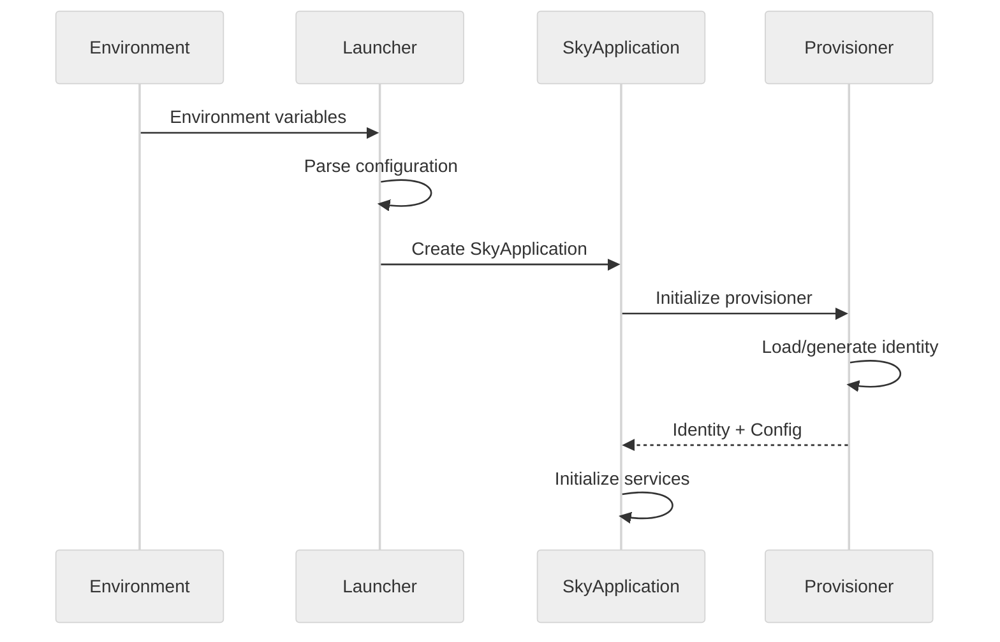
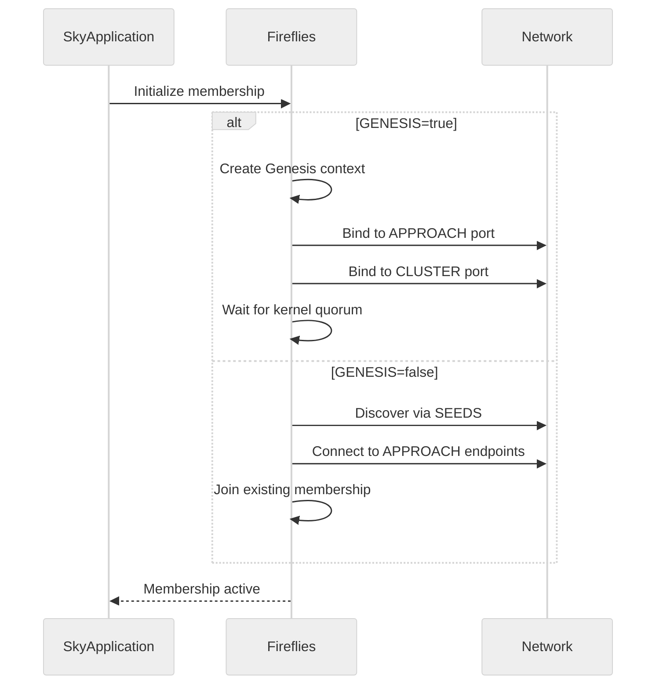
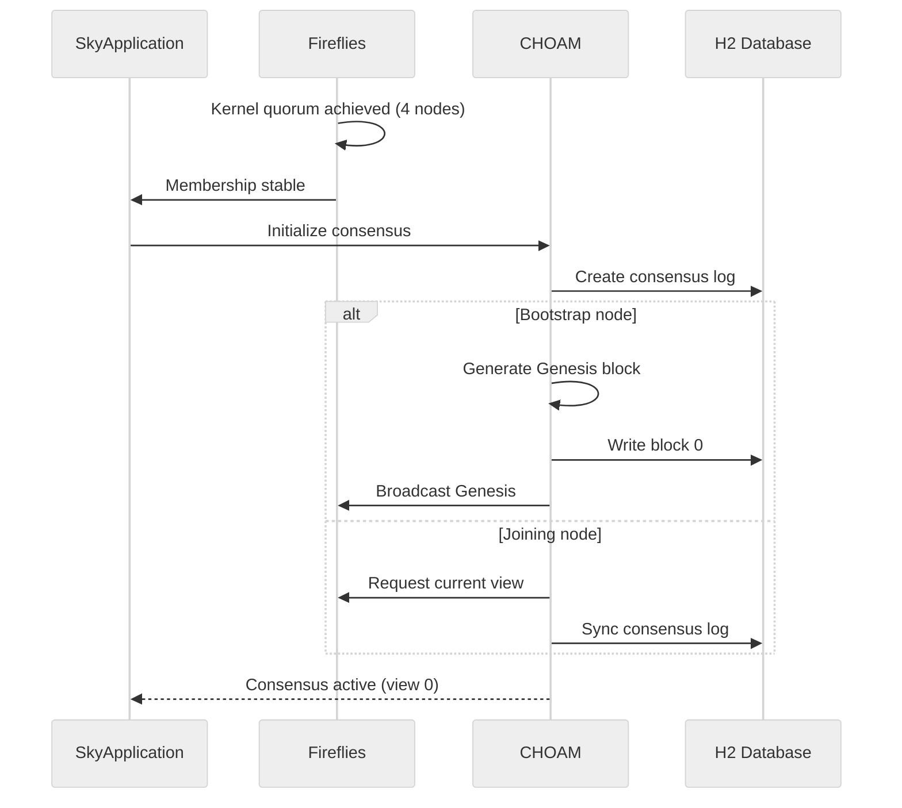
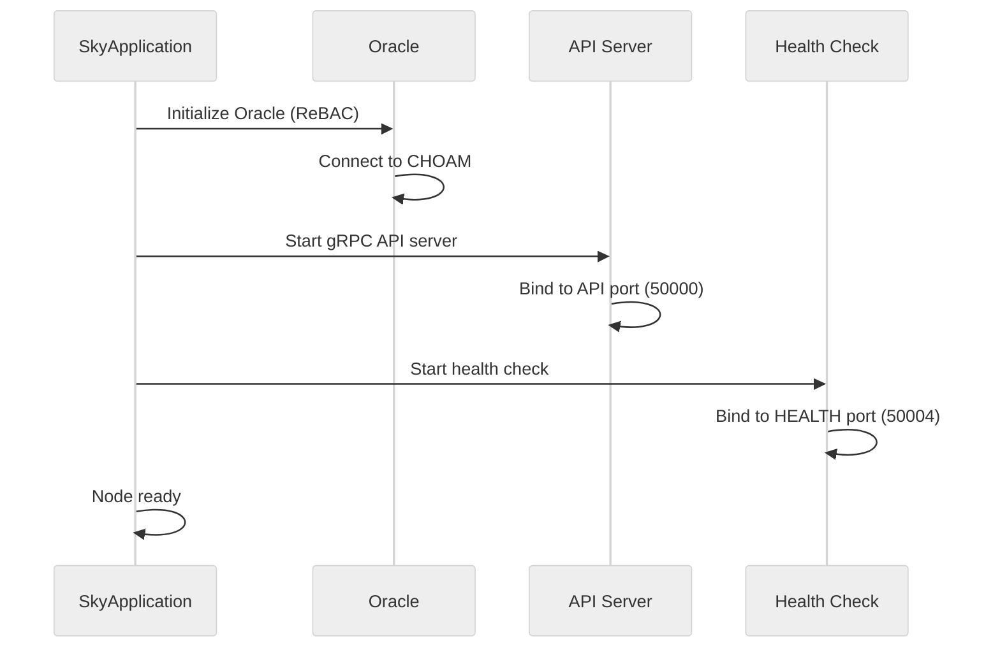
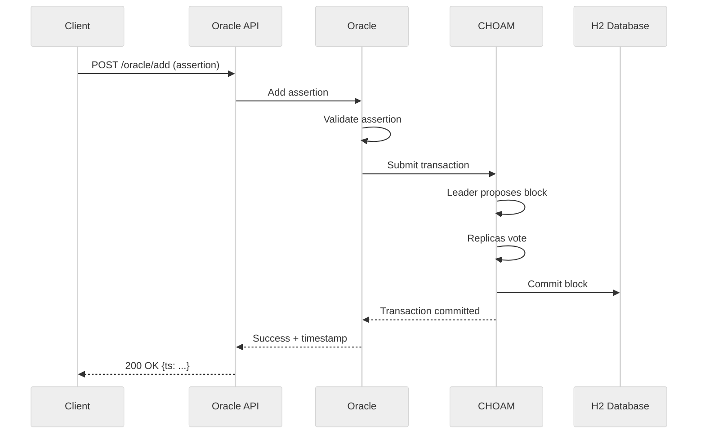
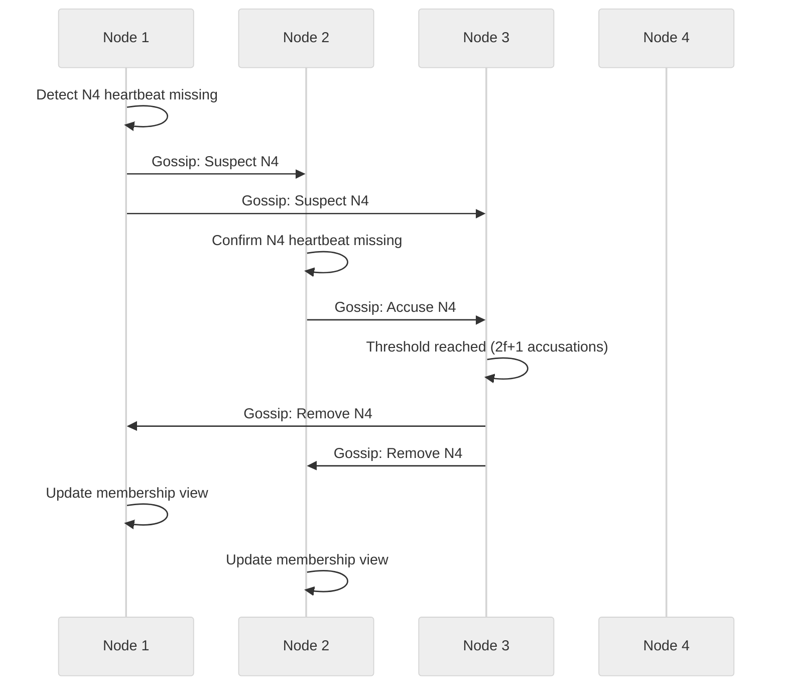

# Sky Application Architecture

**Version**: 1.0
**Last Updated**: 2026-01-07
**Reading Time**: 15 minutes

---

## Overview

Sky is a fantasy proof-of-concept demonstrating a **self-bootstrapping, Byzantine fault-tolerant (BFT) identity and secrets management cluster** built on the Delos platform. This document explains how the pieces fit together.

### At a Glance

- **Purpose**: Demonstrate BFT consensus + identity + secrets management
- **Consensus**: CHOAM (Byzantine fault-tolerant consensus from Delos)
- **Membership**: Fireflies (BFT membership protocol)
- **Identity**: Stereotomy (KERL - Key Event Receipt Log)
- **Crypto**: Gorgoneion (cryptographic infrastructure)
- **Bootstrap**: Shamir secret sharing for cluster initialization
- **Communication**: gRPC with MTLS (mutual TLS)

---

## System Architecture

### High-Level View




### Multi-Node Cluster View




---

## Module Architecture

### Core Modules

#### nut (Core Runtime)

**Responsibility**: Node lifecycle management, bootstrapping, provisioning

**Key Classes**:
- `Launcher.java` - Entry point, parses configuration, initializes node
- `SkyApplication.java` - Main coordinator, manages all services
- `Provisioner.java` - Configuration and provisioning logic
- `BootstrapService.java` - Cluster initialization via Shamir secret sharing

**Dependencies**: Delos (Fireflies, CHOAM, Stereotomy), H2, gRPC

**What it does**:
1. Reads configuration from environment variables
2. Generates or loads cryptographic identity
3. Initializes Fireflies membership
4. Bootstraps CHOAM consensus (if GENESIS=true)
5. Starts Oracle API server
6. Handles graceful shutdown

#### sky (Shaded JAR)

**Responsibility**: Package all dependencies into single executable JAR

**Key Files**:
- `pom.xml` - Maven shade plugin configuration

**What it does**:
- Uses Maven shade plugin to bundle nut + all dependencies
- Creates `sky-<version>-shaded.jar`
- Single artifact for Docker image

#### sanctum (Identity Wrapper)

**Responsibility**: Enclave signing and verification operations

**Key Classes**:
- Identity and cryptographic operations wrapper
- Provides enclave signing capabilities

**Dependencies**: Delos Stereotomy, cryptographic libraries

#### sanctum-sanctorum (Enclave Server)

**Responsibility**: Token generation and KERL protocol management

**Key Classes**:
- `TokenGenerator.java` - Generates Fernet tokens for node recognition
- KERL protocol implementation

**What it does**:
- Manages cryptographic tokens for node identity
- Implements Key Event Receipt Log (KERL) protocol
- Handles enclave-based signing operations

#### grpc (Protocol Definitions)

**Responsibility**: gRPC service interfaces and Protocol Buffer definitions

**Key Files**:
- `src/main/proto/*.proto` - Service definitions
- Generated Java classes in `target/generated-sources/`

**Services Defined**:
- Oracle API (relationship management)
- Inter-node communication protocols

**Build Process**:
- protoc compiler generates Java classes
- build-helper-maven-plugin adds generated sources

#### constants (Shared Constants)

**Responsibility**: Constants shared across modules

**What it contains**:
- Network port defaults
- Protocol version numbers
- Shared configuration keys

### Supporting Modules

#### sky-image (Docker Image)

**Responsibility**: Container image builder

**Key Files**:
- `Dockerfile` - Multi-stage build
- `entrypoint.sh` - Container startup script

**Environment Variables**: See [examples/.env.example](examples/.env.example)

**What it does**:
1. Copies shaded JAR from sky module
2. Sets up JVM environment
3. Exposes ports (API, Approach, Cluster, Service, Health)
4. Runs `java -jar sky-shaded.jar` with environment config

#### local-demo (End-to-End Tests)

**Responsibility**: Docker Compose configurations and smoke tests

**Structure**:
```
local-demo/
├── bootstrap/compose.yaml      # Bootstrap node (Genesis)
├── kernel/compose.yaml          # 3 kernel nodes (minimal quorum)
├── nodes/compose.yaml           # Scalable additional nodes
└── src/test/java/
    └── SmokeTest.java           # Automated E2E test
```

**What it does**:
- Provides Docker Compose configs for local cluster
- Implements automated smoke test using TestContainers
- Demonstrates Oracle API usage

---

## Bootstrap Sequence

### Phase 1: Node Initialization




**Steps**:
1. `Launcher.main()` reads environment variables
2. Parse configuration (ports, bind interface, seeds, etc.)
3. Create `SkyApplication` instance
4. `Provisioner` loads or generates cryptographic identity (self-signed cert + private key)
5. Return identity and configuration to `SkyApplication`

### Phase 2: Membership Initialization




**Steps**:
1. Initialize Fireflies membership protocol
2. If `GENESIS=true`:
   - Create Genesis context (first member)
   - Bind to well-known address (e.g., 172.17.0.2)
   - Wait for 3 more kernel members
3. If `GENESIS=false`:
   - Use `SEEDS` to discover existing cluster
   - Connect via `APPROACHES` endpoints
   - Join membership via Fireflies protocol

### Phase 3: Consensus Initialization




**Steps**:
1. Fireflies reports kernel quorum achieved (4 members)
2. Initialize CHOAM consensus protocol
3. Create H2 database for consensus log
4. Bootstrap node generates **Genesis block** (block 0, view 0)
5. Genesis block committed via BFT consensus
6. Joining nodes synchronize consensus log
7. Cluster is now operational

### Phase 4: Service Startup




**Steps**:
1. Initialize Oracle (relationship-based access control engine)
2. Oracle connects to CHOAM for persistence
3. Start gRPC API server on API port (default 50000)
4. Start health check endpoint (default 50004)
5. Node is fully operational and ready for requests

---

## Key Concepts

### Shamir Secret Sharing

**What**: Cryptographic scheme to split a secret into N shares, requiring K shares to reconstruct

**Used in Sky**:
- Bootstrap cluster with shared secret
- In POC, secret is hardcoded for convenience
- Production would use interactive secret sharing ceremony

**How it works**:
1. Secret S split into N shares (e.g., 5 shares)
2. Threshold K required to reconstruct (e.g., 3 of 5)
3. Any K shares can reconstruct S
4. Fewer than K shares reveal nothing

**Code**: See `nut/src/main/java/com/hellblazer/nut/BootstrapService.java`

### Byzantine Fault Tolerance (BFT)

**What**: System tolerates up to f malicious (Byzantine) failures in 3f+1 nodes

**Used in Sky**:
- Fireflies membership (BFT membership protocol)
- CHOAM consensus (BFT consensus protocol)
- Tolerates 1 Byzantine failure with 4 nodes (minimal quorum)

**Why it matters**:
- Nodes can behave arbitrarily (crash, lie, collude)
- System still reaches consensus if ≤f nodes are Byzantine
- No trusted third party needed

**Trade-off**: Higher overhead than crash-fault-tolerant (CFT) systems like Raft

### KERL (Key Event Receipt Log)

**What**: Self-certifying identifier (SCID) based on cryptographic key events

**Used in Sky**:
- Node identity management
- Each node has a KERL-based decentralized identifier (DID)
- Key rotation without centralized authority

**Key Events**:
1. **Inception**: Create initial identifier with public key
2. **Rotation**: Rotate to new key, signed by old key
3. **Interaction**: Sign data, proving control of identifier

**Benefits**:
- No central certificate authority needed
- Cryptographically verifiable history
- Key rotation with forward secrecy

**Code**: See `sanctum-sanctorum/` and Delos Stereotomy

### CHOAM Consensus

**What**: Byzantine fault-tolerant consensus protocol from Delos

**Similarities to Raft**:
- Leader-based
- Log replication
- View changes (leader elections)

**Differences from Raft**:
- Tolerates Byzantine failures (not just crash failures)
- Higher overhead (3f+1 vs 2f+1 nodes)
- Cryptographic verification of messages

**How it works in Sky**:
1. Leader proposes blocks (batches of transactions)
2. Replicas verify and vote
3. If ≥2f+1 votes, block is committed
4. If leader fails, view change elects new leader

**Code**: From Delos CHOAM module

### Fireflies Membership

**What**: Byzantine fault-tolerant membership protocol from Delos

**What it provides**:
- Dynamic membership (nodes join/leave)
- Failure detection
- Membership view agreement (all honest nodes agree on membership)

**How it works**:
- Nodes gossip membership information
- Suspicion and accusation mechanism for failures
- View changes when membership changes
- Integrates with CHOAM for consensus on membership

**Ports**:
- **APPROACH**: New nodes connect here to join
- **CLUSTER**: Member-to-member gossip

**Code**: From Delos Fireflies module

---

## Data Flow

### Oracle API Request Flow




**Flow**:
1. Client sends gRPC request to Oracle API (e.g., add permission)
2. Oracle validates the request (schema, authentication)
3. Oracle submits transaction to CHOAM consensus
4. CHOAM leader proposes a block containing the transaction
5. Replicas vote on the block (BFT consensus)
6. If ≥2f+1 votes, block is committed to H2 database
7. Oracle returns success with commit timestamp
8. Client receives confirmation

### Membership Gossip Flow




**Flow**:
1. Node 1 detects Node 4 is not responding (heartbeat timeout)
2. Node 1 gossips "Suspect N4" to peers
3. Node 2 confirms N4 is unresponsive
4. Node 2 gossips "Accuse N4"
5. When ≥2f+1 nodes accuse N4, it's removed from membership
6. All nodes update their membership view
7. Fireflies triggers view change in CHOAM

---

## Configuration

### Environment Variables

See [examples/.env.example](examples/.env.example) for complete reference. Key variables:

| Variable | Purpose | Example | Required |
|----------|---------|---------|----------|
| `GENESIS` | Genesis kernel member | `'true'` | Yes (for kernel) |
| `BIND_INTERFACE` | Network interface | `eth0` | Yes |
| `API` | Oracle API port | `50000` | No (default: 50000) |
| `APPROACH` | Fireflies approach port | `50001` | No (default: 50001) |
| `CLUSTER` | Fireflies cluster port | `50002` | No (default: 50002) |
| `SERVICE` | Internal service port | `50003` | No (default: 50003) |
| `HEALTH` | Health check port | `50004` | No (default: 50004) |
| `APPROACHES` | Discovery endpoints | `172.17.0.2:50001` | No (for joining nodes) |
| `SEEDS` | Cluster endpoints | `172.17.0.2:50002#50000` | No (for joining nodes) |

### Port Mapping

```
┌─────────────────────────────────────┐
│         Sky Node                    │
├─────────────────────────────────────┤
│ Port 50000: Oracle API (gRPC)      │  ← Client requests
│ Port 50001: Fireflies APPROACH     │  ← New node discovery
│ Port 50002: Fireflies CLUSTER      │  ← Membership gossip
│ Port 50003: Internal SERVICE       │  ← Internal RPC
│ Port 50004: Health Check (HTTP)    │  ← Monitoring
└─────────────────────────────────────┘
```

---

## Database Schema

Sky uses H2 database with two main schemas:

### Consensus Log (CHOAM)

```sql
-- Simplified schema (actual schema in Delos CHOAM)
CREATE TABLE blocks (
    view BIGINT,
    sequence BIGINT,
    hash BINARY,
    previous_hash BINARY,
    transactions BLOB,
    signatures BLOB,
    PRIMARY KEY (view, sequence)
);
```

### Oracle State (Relationships)

```sql
-- Simplified schema (actual schema in Delos Oracle)
CREATE TABLE assertions (
    subject_id UUID,
    object_id UUID,
    relation_id UUID,
    timestamp BIGINT,
    deleted BOOLEAN,
    PRIMARY KEY (subject_id, object_id, relation_id)
);

CREATE INDEX idx_object ON assertions(object_id);
CREATE INDEX idx_relation ON assertions(relation_id);
```

---

## Testing Architecture

### Unit Tests

- Each module has `src/test/java` with JUnit 5 tests
- Mock dependencies for isolation
- Fast execution (seconds)

### Integration Tests

- `local-demo/src/test/java/SmokeTest.java`
- Uses TestContainers to run actual Docker containers
- Tests end-to-end flow with multiple nodes
- Slower execution (minutes)
- Requires Docker and 10GB heap (-Xmx10G)

### Test Execution

```bash
# Unit tests only
./mvnw test

# Integration tests (requires Docker)
./mvnw -P e2e test -pl local-demo
```

---

## Security Model

### Authentication

- **Node-to-node**: MTLS with self-signed certificates
- **Client-to-API**: MTLS (in production) or no auth (POC)
- **Identity**: KERL-based decentralized identifiers

### Authorization

- **Oracle API**: ReBAC (relationship-based access control)
- **Transitive permissions**: Checked via Oracle.expand()
- **Predicate filtering**: Supports filtered queries (e.g., flagged users)

### Cryptography

- **Certificates**: Self-signed X.509 (ephemeral in POC)
- **Signatures**: Ed25519 (from Delos Gorgoneion)
- **Tokens**: Fernet symmetric encryption
- **Randomness**: SecureRandom (see KNOWN_LIMITATIONS.md #35)

### Threat Model (POC)

- ✅ **Tolerates**: Up to f=1 Byzantine node failures
- ✅ **Protects**: Consensus integrity, identity verification
- ❌ **Does NOT protect**: Network eavesdropping (no encryption at rest), long-term secret rotation
- ❌ **POC only**: Hardcoded secrets, INFO-level logging

See [KNOWN_LIMITATIONS.md](KNOWN_LIMITATIONS.md) for full security constraints.

---

## Performance Characteristics

### Latency

- **Oracle read** (local): <10ms
- **Oracle write** (consensus): 50-200ms (depends on cluster size)
- **Membership gossip**: 100-500ms (heartbeat interval)

### Throughput

- **Transactions/sec**: 100-1000 (depends on cluster size, network)
- **Batch size**: CHOAM batches transactions into blocks

### Scalability

- **Tested**: 4-10 nodes in POC
- **BFT overhead**: O(n²) message complexity
- **Production**: Would need profiling and optimization

### Resource Usage

- **Memory**: ~2GB per node (includes JVM, H2, consensus state)
- **Disk**: ~100MB per node (consensus log grows over time)
- **Network**: ~1-10 Mbps per node (gossip + consensus)

---

## Deployment Topologies

### Single-Host Demo (Docker Compose)

```
┌──────────────────────────────────────────┐
│            Host Machine                   │
│  ┌────────┐ ┌────────┐ ┌────────┐        │
│  │ Node 0 │ │ Node 1 │ │ Node 2 │ ...    │
│  └────────┘ └────────┘ └────────┘        │
│         Bridge Network (172.17.0.0/16)    │
└──────────────────────────────────────────┘
```

**Use**: Local testing, demos

### Multi-Host Cluster (Production-like)

```
┌──────────┐    ┌──────────┐    ┌──────────┐
│  Host 1  │    │  Host 2  │    │  Host 3  │
│ ┌──────┐ │    │ ┌──────┐ │    │ ┌──────┐ │
│ │Node 0│ │◄──►│ │Node 1│ │◄──►│ │Node 2│ │
│ └──────┘ │    │ └──────┘ │    │ └──────┘ │
└──────────┘    └──────────┘    └──────────┘
     ▲               ▲               ▲
     └───────────────┴───────────────┘
            WAN/Internet
```

**Use**: Production deployment (requires configurable network)

---

## Troubleshooting Architecture

Common architectural issues:

| Symptom | Likely Cause | Check |
|---------|-------------|-------|
| Cluster won't form | Fewer than 4 nodes | `docker ps` count |
| Genesis not committed | Network partition | `docker network inspect` |
| High latency | Too many nodes | Reduce cluster size (POC) |
| Memory errors | Insufficient heap | Check `-Xmx` in pom.xml |
| Node can't join | Wrong SEEDS | Check `APPROACHES/SEEDS` env vars |

See [TROUBLESHOOTING.md](TROUBLESHOOTING.md) for detailed solutions.

---

## Next Steps

After understanding the architecture:

1. **Run the demo**: Follow [DEMO_GUIDE.md](DEMO_GUIDE.md)
2. **Explore code**: Start with `nut/src/main/java/com/hellblazer/nut/Launcher.java`
3. **Read Delos docs**: Understand Fireflies, CHOAM, Stereotomy
4. **Modify smoke test**: Add your own relationships and permissions
5. **Review limitations**: See [KNOWN_LIMITATIONS.md](KNOWN_LIMITATIONS.md)

---

## References

- **Delos Platform**: https://github.com/Hellblazer/Delos
- **Fireflies**: BFT membership protocol (see Delos)
- **CHOAM**: BFT consensus protocol (see Delos)
- **Stereotomy/KERL**: DID and key management (see Delos)
- **Gorgoneion**: Cryptographic infrastructure (see Delos)
- **Zanzibar**: Google's ReBAC system (inspiration for Oracle)

---

**End of Architecture Guide** - You should now understand Sky's structure, bootstrap sequence, key concepts, and how components interact. Read [DEMO_GUIDE.md](DEMO_GUIDE.md) to see it in action!
